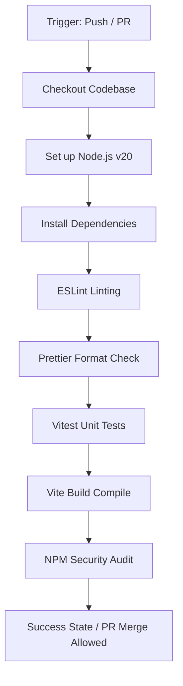

# CI/CD Validation Pipeline (COSC Hackweek)

An automated, robust, and industry-standard Continuous Integration (CI) pipeline built for modern web applications. This repository serves as a showcase of a secure and fully validated development workflow, ensuring that every code contribution is automatically checked for code quality, formatting, styling correctness, test coverage, and security vulnerabilities before integration.

---

## 🚀 Key Features

*   **Trigger Mechanisms**: Automatically executes validation checks on every `push` to the `main` branch and when any `pull_request` targets the `main` branch.
*   **Dependency Management**: Deterministic environment-independent installation of project dependencies.
*   **Automated Linting**: Executes ESLint checks across the codebase to capture syntax errors, unused imports, and bad coding practices early.
*   **Code Formatting Audit**: Performs formatting checks using Prettier to enforce consistent code style across all contributors.
*   **Automated Unit Testing**: Runs test suites using Vitest to verify mathematical utilities and business logic.
*   **Production Bundling**: Builds the application through Vite to ensure compilation steps run successfully without errors.
*   **Security Auditing**: Performs a security vulnerability scan on all node modules using `npm audit` to capture package vulnerabilities early.

---

## 🛠️ Architecture & Workflow

The CI/CD pipeline runs on an `ubuntu-latest` GitHub Runner, utilizing the following sequential stages:



---

## 📂 Project Structure

```
your-project/
├── .github/
│   └── workflows/
│       └── ci.yml      # CI Workflow Configuration
├── src/                # React Source Files
│   ├── utils.js        # Helper functions
│   └── utils.test.js   # Unit test suite
├── package.json        # Dependencies & Scripts
├── package-lock.json   # Synced lockfile
└── README.md           # Documentation
```

---

## 💻 Local Setup & Development

### Prerequisites
*   Node.js (v20 or higher)
*   npm (v10 or higher)

### Installation
Clone the repository and install dependencies:
```bash
git clone https://github.com/gdhanushkumar07/CI-pipeline.git
cd CI-pipeline
npm install
```

### Running Validation Locally
You can run all validation steps locally before pushing changes:

```bash
# Run ESLint validation
npm run lint

# Run Code style formatting check
npm run format:check

# Run Unit tests
npm run test

# Compile production build
npm run build

# Run security audit scan
npm audit
```
